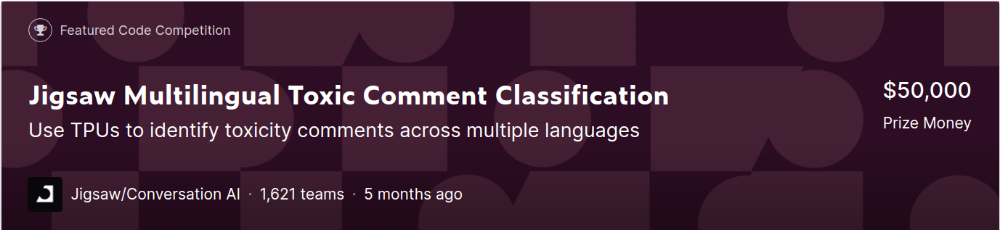

# Solution Approaches:
* XLM-Roberta
* BERT
* Ensemble
* Kernel Blending

# Notebooks:
* [Final Ensemble Notebook](JigsawMultilingualToxicComments%5BEnsemble%5D.ipynb)
* [Ensemble Notebook Live on Kaggle](https://www.kaggle.com/redwankarimsony/jigsawmultilingualtoxiccomments-ensemble)

# Final Results: 
330 th out of 1621 teams (Top 21%)
